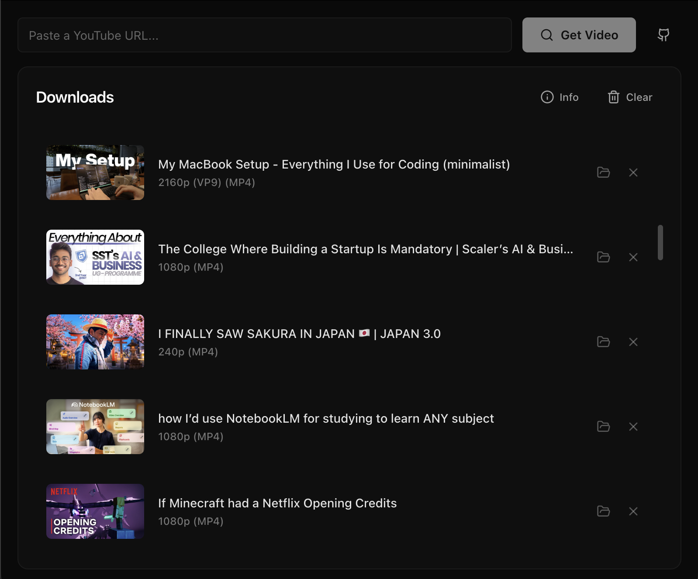
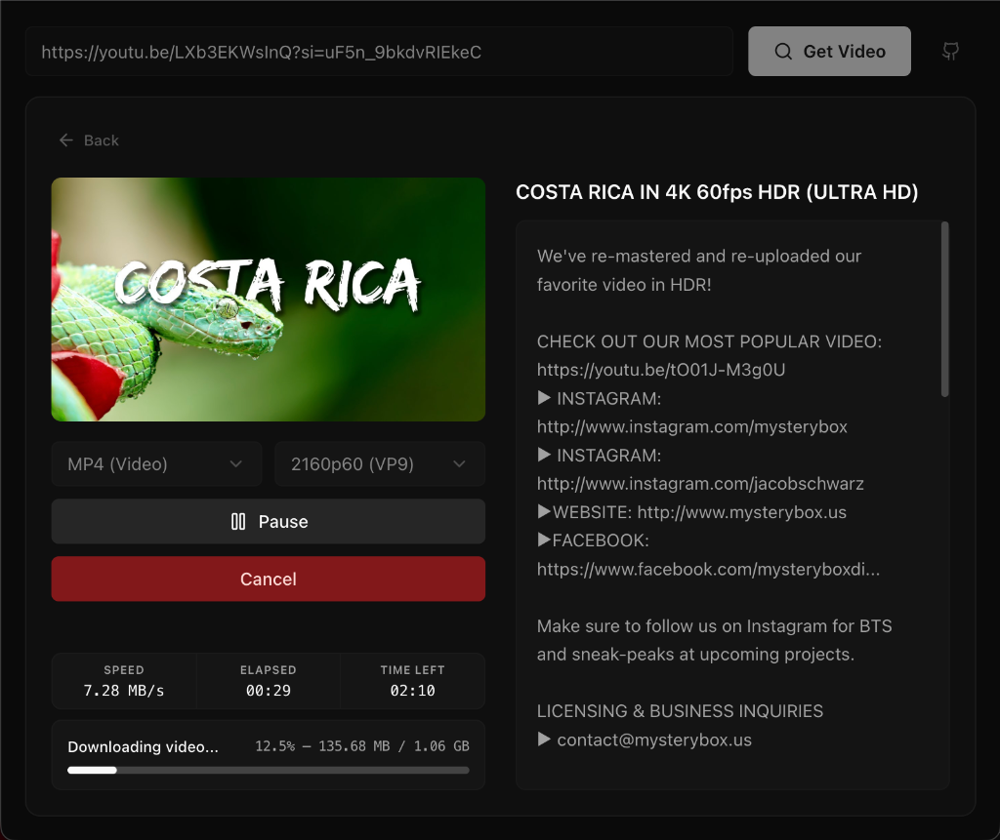

  

  <h1>YT-FORGE</h1>

  

    A fast, modern desktop YouTube downloader designed for creators and editors.
  

  

    macOS • Windows • Linux  

  

---

## Overview

**YT-FORGE** is a lightweight desktop application built on top of the powerful  
[`yt-dlp`](https://github.com/yt-dlp/yt-dlp) engine.

It focuses on three things:

• Speed  
• Simplicity  
• Editor-friendly downloads

Unlike many downloaders, YT-FORGE prioritizes **H.264 video and AAC audio** formats, ensuring smooth playback and seamless compatibility with professional editing software such as **Premiere Pro**, **Final Cut Pro**, and **DaVinci Resolve**.

---

## Features

 **Fast Downloads**  
Powered by the battle-tested `yt-dlp` engine.

 **Minimal Interface**  
Clean dark UI built with React and Shadcn UI.

 **Editor-Friendly Formats**  
Automatically prefers H.264 + AAC (MP4) over AV1/VP9.

 **No Ads. No Tracking.**  
Fully open-source and transparent.

---

## Interface

  
  &nbsp;
  

---

## Download

Installers are available for all major platforms.

**Latest release:**  
https://github.com/Shaikh-Suja-Rahaman/YT-Forge/releases/latest

| Platform | File |
|--------|------|
| macOS (Apple Silicon) | `YT-FORGE-x.x.x-arm64.dmg` |
| Windows | `YT-FORGE Setup x.x.x-x64.exe` |
| Windows ARM | `YT-FORGE Setup x.x.x-arm64.exe` |
| Linux | `YT-FORGE-x.x.x-x64.AppImage` |
| Linux ARM | `YT-FORGE-x.x.x-arm64.AppImage` |

---

## Security Notice

Because this is an independent open-source application without enterprise code-signing certificates, your operating system may show a warning on first launch.

**Windows:**  
`More Info` → `Run Anyway`

**macOS:**  
`System Settings → Privacy & Security → Open Anyway`

This approval is required **only once**.

---

## Legal

YT-FORGE is a graphical interface for the open-source **yt-dlp** project.

This application does not modify or circumvent the original software.

Please download only content that you have permission to access or distribute.

---

Built with Electron, React, and Vite.

